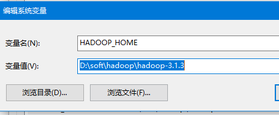
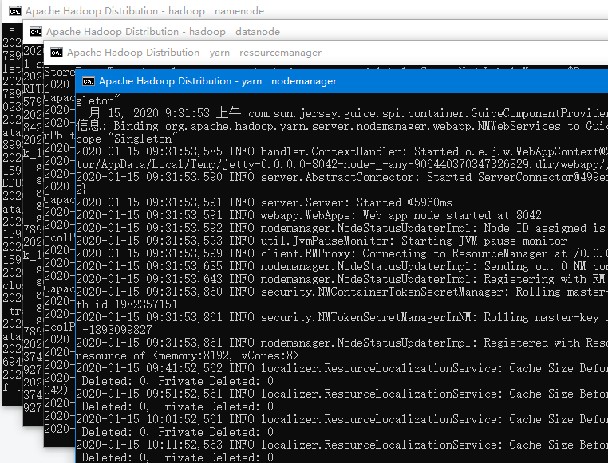

## windows10 搭建最新的 hadoop 3.1.3 和 hbase 2.2.2 测试环境

# 一、环境准备

## 1、JDK

## 2、Hadoop安装包 

官网 :[https://archive.apache.org/dist/hadoop/common/](https://links.jianshu.com/go?to=https%3A%2F%2Farchive.apache.org%2Fdist%2Fhadoop%2Fcommon%2F)

https://mirrors.tuna.tsinghua.edu.cn/apache/hadoop/common/hadoop-3.1.3/

https://www-eu.apache.org/dist/hadoop/common/hadoop-3.1.3/

## 3、hadooponwindows-master

下载地址 :https://github.com/cdarlint/winutils

[https://github.com/steveloughran/winutils](https://links.jianshu.com/go?to=https%3A%2F%2Fgithub.com%2Fsteveloughran%2Fwinutils)

选择[3.1.3](https://www-eu.apache.org/dist/hadoop/common/hadoop-3.1.3/)使用

## 4、hbase安装包 

官网 :[http://archive.apache.org/dist/hbase/](https://links.jianshu.com/go?to=http%3A%2F%2Farchive.apache.org%2Fdist%2Fhbase%2F)

[http://archive.apache.org/dist/hbase/2.2.2/](https://archive.apache.org/dist/hbase/2.2.2/)

# 二 版本对应关系 

## 1 Hadoop与Hbase对应的版本

## 2 Hbase与Jdk对应的版本

# 三 开始安装

## 1 解压各个目录

## 2 设置环境变量

我的电脑 --> 属性 --> 高级系统设置 --> 高级 --> 环境变量，新建HADOOP_HOME，

然后将%HADOOP_HOME%\bin添加到Path中。

## 3 修改配置文件

主要修改这些文件

***原则上,只需要修改下面的文件地址即可.<加粗部分>. 同时如果没有文件夹,最好创建一个workplace***

### **core-site.xml**

<configuration>

​    <property>        <name>fs.defaultFS</name>        <value>hdfs://localhost:8020/hbase</value>    </property>    <property>        <name>hadoop.tmp.dir</name>        <value>/D:/soft/hadoop/hadoop-3.1.3/workplace/tmp</value>    </property>    <property>        <name>fs.trash.interval</name>        <value>1440</value>    </property>

</configuration>
 

### hdfs-site.xml

<configuration> <!-- 这个参数设置为1，因为是单机版hadoop -->       <property>        <name>dfs.replication</name>        <value>1</value>    </property>    <property>         <name>dfs.permissions.enabled</name>         <value>false</value>     </property>    <property>        <name>dfs.namenode.name.dir</name>        <value>/D:/soft/hadoop/hadoop-3.1.3/workplace/data/namenode</value>    </property>    <property>        <name>fs.checkpoint.dir</name>        <value>/D:/soft/hadoop/hadoop-3.1.3/workplace/data/snn</value>    </property>    <property>        <name>fs.checkpoint.edits.dir</name>        <value>/D:/soft/hadoop/hadoop-3.1.3/workplace/data/snn</value>    </property>        <property>        <name>dfs.datanode.data.dir</name>        <value>/D:/soft/hadoop/hadoop-3.1.3/workplace/data/datanode</value>    </property>

</configuration>

 

### yarn-site.xml

<configuration>

<!-- Site specific YARN configuration properties --><property>       <name>yarn.nodemanager.aux-services</name>       <value>mapreduce_shuffle</value>    </property>    <property>       <name>yarn.nodemanager.aux-services.mapreduce.shuffle.class</name>       <value>org.apache.hadoop.mapred.ShuffleHandler</value>    </property></configuration>

 

### mapred-site.xml

<configuration> <property>       <name>mapreduce.framework.name</name>       <value>yarn</value>    </property>    <property>       <name>mapred.job.tracker</name>       <value>hdfs://localhost:9001</value>    </property></configuration>

### hadoop-env.cmd

修改

@rem set JAVA_HOME=%JAVA_HOME%

set JAVA_HOME=**D:\PROGRA~1\Java\jdk1.8.0_201**

注意:这里PROGRA~1 有的电脑可能是PROGRA~2 .具体了解dos的8.3命名规则

## 4 使用winutils-master 覆盖

下载的文件包没有3.1.3 .我们使用3.1.2. 差一个版本问题不大,如果能找到匹配的最好了.

复制这些文件到

覆盖替换原文件即可

## 5 启动格式化HDFS

首先，hadoop version，查看是否能正常运行

执行 hdfs namenode -format

## 6 尝试运行hadoop

进入sbin目录 不是bin

运行 start-all

启动后没保存 表示正常

## 7 测试hadoop启动是否正常

### 进入hdfs管理页面

 http://localhost:9870/

### 进入资源调度管理（yarn）

访问地址 :http://localhost:8088/

hadoop启动完成 我们配置hbase

# 四 配置hbase

## 1 修改配置文件

###  hbase-site.xml

<configuration>

​    <property>          <name>hbase.rootdir</name>          <value>hdfs://localhost:8020/hbase</value>      </property>      <property>          <name>hbase.tmp.dir</name>          <value>D:/soft/hadoop/hbase-2.2.2/workplace/tem</value>      </property>      <property>          <name>hbase.zookeeper.quorum</name>          <value>127.0.0.1</value>      </property>      <property>          <name>hbase.zookeeper.property.dataDir</name>          <value>D:/soft/hadoop/hbase-2.2.2/workplace/zoo</value>      </property>      <property>          <name>hbase.cluster.distributed</name>          <value>false</value>      </property>      <property>        <name>hbase.unsafe.stream.capability.enforce</name>        <value>false</value>    </property></configuration>

###  hbase-env.cmd

最后添加三行

set HBASE_MANAGES_ZK=false
set JAVA_HOME=**D:\PROGRA~2\Java\jdk1.8.0_201**
set HBASE_CLASSPATH=**D:\soft\hadoop\hbase-2.2.2**\conf

## 2 尝试启动

start-hbase

启动无报错

## 3 测试网址

http://localhost:16010/master-status

就此 配置完成

如有报错, 观察端口会不会被别的占用了. 比如iis,自己的服务等