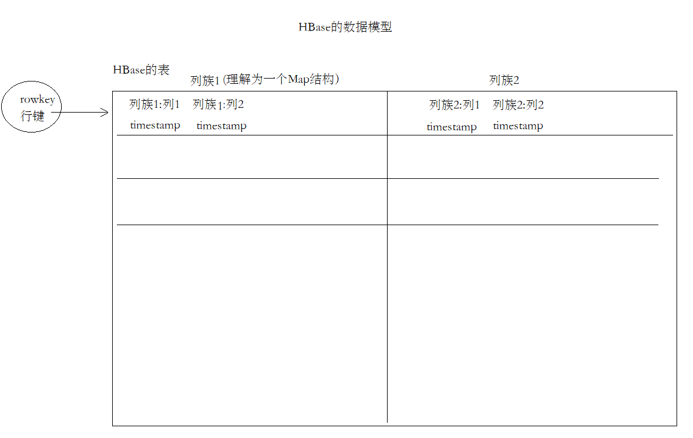

# HBase第一天

## Hadoop和HBase

* HBase是基于Hadoop集群之上来搭建的
* Hadoop有一些局限性的：
	* 做一些批量的数据处理，吞吐量比较高，但是它对随机查询、实时操作性能是不行的
* HBase是NoSQL数据库的一种，它跟传统的RDBMS有很大的差别
* 不支持JOIN的，摒弃了关系型模型，而且在HBase中只有一种数据类型：byte[]
* HBase可以用来存储非常大的表，上亿行的数据、有超过百万列，而且它常用在实时数据处理中。因为它的读写是很快的。

## HBase的应用场景

* HBase只要有海量数据存储，而且需要快速的写入以及快速的读取场景，就很适合HBase
* 但要记住NoSQL的特点：对事务的支持性较弱的
* 可以用来存储爬虫的数据、点赞/转发、银行转账订单....

## Hbase对于RDBMS对比Hive

* RDBMS是关系型数据库支持join、ACID、有schema（创建表的时候必须要指定有哪些列、列是什么类型）...、支持二级索引
* HBase不支持join的、也不支持ACID、对事务支持有限，无schema（创建表的时候，无需去指定列、列类型）、原生就支持分布式存储的，所以可以用来存储海量数据，同时也兼顾了快速查询、写入的功能


对比Hive：

* Hive主要用于OLAP，HBase主要用于OLTP，HBase是可以直接接入到业务系统的

## HBase的安装

注意：

* HBase依赖于：ZooKeeper、HDFS，在启动HBase之前必须要启动ZK、HDFS，否则HBase无法启动
* Webui: http://node1.itcast.cn:16010/master-status#baseStats

## 5. HBase的数据模型

* HBase中是有表的概念的
* 一个表中可以包含多个列族
* 一个列族可以包含很多的列
* 每一个列对应的单元格（值、timestamp）



## HBase的一些操作

### 创建表

* HBase是没有schema的，就是在创建表的时候不需要指定表中有哪些列，只需要指定有多少个列蔟

```ruby
create "表名","列蔟1", "列蔟2"
```

### 删除表

* 禁用表

	disable "表名"

* 删除表

	drop "删除表"

### 新增数据/更新数据/删除数据/查询数据

* 新增：put "表名", "rowkey", "列蔟:列名", "值"
	* 新增一列
* 更新：和新增是一样的
* 删除数据
	* delete "表名", "rowkey", "列蔟:列名"
		* delete也是删除一个列
	* deleteall "表名", "rowkey"
		* 删除一行
* 查询数据
	* get "表名", "rowkey"
		* get是查询一行的数据


* 删除数据的时候，其实HBase不是真的直接把数据删除掉，而是给某个列设置一个标志，然后查询数据的时候，有这个标志的数据，就不显示出来
* 什么时候真正的删除数据呢？
	* 后台进程，专门来执行删除数据的操作

>执行delete的时候
>
>* 如果表中的某个列有对一个的几次修改，它会删除最近的一次修改
>* 默认是保存1个保存的时间戳
>* 有一个version属性

### 计数器和简单scan扫描操作

* 计数器
	* count "表名"：hbase就会将这个表对应的所有数据都扫描一遍，得到最终的记录条数（慎用）
	* 执行HBase提供的基于MR的RowCounter的程序（用于做大批量数据的查询）
		* 启动yarn集群
		* 启动mr-historyserver
* scan扫描
	* 全表扫描：scan "表名"（慎用，效率很低）
	* 限定只显示多少条: scan "表名", {LIMIT => XXX}
	* 指定查询某几个列: scan "表名", {LIMIT => XXX, COLUMNS => []}
	* 根据ROWKEY来查询：scan "表名", {LIMIT => XXX, COLUMNS => [], ROWPREFIXFILTER => 'ROWKEY'}

### 使用过滤器的重点

* 语法：
	* 其实在hbase shell中，执行的ruby脚本，背后还是调用hbase提供的Java API
	* 在HBase中有很多的多过滤器，语法格式看起来会比较复杂，所以重点理解这个语法是什么意思
	* 过滤器在hbase shell中是使用一个表达式来描述，在Java里面new各种对象

```ruby
scan "ORDER_INFO", {FILTER => "RowFilter(=,'binary:02602f66-adc7-40d4-8485-76b5632b5b53')", COLUMNS => ['C1:STATUS', 'C1:PAYWAY'], FORMATTER => 'toString'}
```

* `"RowFilter(=,'binary:02602f66-adc7-40d4-8485-76b5632b5b53')"`这个就是一个表达式
	* RowFilter就是Java API中Filter的构造器名称
	* 可以理解为RowFilter()就是创建一个过滤器对象
	* =是JRuby一个特殊记号，表示是一个比较运算符，还可以是>、<、>=...
	* binary:02602f66-adc7-40d4-8485-76b5632b5b53是一个比较器的表达式，为了方便大家理解，可以将比较器理解为配置值的地方，binary:xxxx表示直接和值进行毕节

### 使用HBase的计数器

* 要使用incr来去初始化一个列，一定不能使用put操作
* 可以使用get_couter的指令来获取计数器的操作，使用get是获取不到计数器的数据的
* incr "表名", "rowkey", "列蔟:列", xxx

### HBase一些管理命令

* status：常用命令，可以查看整个集群的运行的节点数
* whoami：查看当前的用户
* disable/enable：禁用/开启表
* drop：删除表
* exists：判断表是否存在
* truncate：清空表

### HBase 建表操作

创建连接

1. 建立HBase连接
2. 创建admin对象

```java

    @BeforeTest
    public void beforeTest() throws IOException {
        // 1.	使用HbaseConfiguration.create()创建Hbase配置
        Configuration configuration = HBaseConfiguration.create();
        // 2.	使用ConnectionFactory.createConnection()创建Hbase连接
        connection = ConnectionFactory.createConnection(configuration);
        // 3.	要创建表，需要基于Hbase连接获取admin管理对象
        // 要创建表、删除表需要和HMaster连接，所以需要有一个admin对象
        admin = connection.getAdmin();
    }
```

创建表

* 调用tableExists判断表是否存在
* 在HBase中，要去创建表，需要构建TableDescriptor（表描述器）、ColumnFamilyDescriptor（列蔟描述器），这两个对象不是直接new出来，是通过builder来创建的
* 将列蔟描述器添加到表描述器中
* 使用admin.createTable创建表

```java
    @Test
    public void createTableTest() throws IOException {
        TableName tableName = TableName.valueOf("WATER_BILL");

        // 1.	判断表是否存在
        if(admin.tableExists(tableName)) {
            // a)	存在，则退出
            return;
        }

        // 构建表
        // 2.	使用TableDescriptorBuilder.newBuilder构建表描述构建器
        // TableDescriptor: 表描述器，描述这个表有几个列蔟、其他的属性都是在这里可以配置
        TableDescriptorBuilder tableDescriptorBuilder = TableDescriptorBuilder.newBuilder(tableName);

        // 3.	使用ColumnFamilyDescriptorBuilder.newBuilder构建列蔟描述构建器
        // 创建列蔟也需要有列蔟的描述器，需要用一个构建起来构建ColumnFamilyDescriptor
        // 经常会使用到一个工具类：Bytes（hbase包下的Bytes工具类）
        // 这个工具类可以将字符串、long、double类型转换成byte[]数组
        // 也可以将byte[]数组转换为指定类型
        ColumnFamilyDescriptorBuilder columnFamilyDescriptorBuilder = ColumnFamilyDescriptorBuilder.newBuilder(Bytes.toBytes("C1"));

        // 4.	构建列蔟描述，构建表描述
        ColumnFamilyDescriptor cfDes = columnFamilyDescriptorBuilder.build();

        // 建立表和列蔟的关联
        tableDescriptorBuilder.setColumnFamily(cfDes);
        TableDescriptor tableDescriptor = tableDescriptorBuilder.build();

        // 5.	创建表
        admin.createTable(tableDescriptor);
    }
```


>在HBase中所有的数据都是以byte[]形式来存储的，所以需要将Java的数据类型进行转换
>
>```
>// 经常会使用到一个工具类：Bytes（hbase包下的Bytes工具类）
>// 这个工具类可以将字符串、long、double类型转换成byte[]数组
>// 也可以将byte[]数组转换为指定类型
>```

### 插入数据

* 首先要获取一个Table对象，这个对象是要和HRegionServer节点连接，所以将来HRegionServer负载是比较高的
* HBase的connection对象是一个重量级的对象，将来编写代码（Spark、Flink）的时候，避免频繁创建，使用一个对象就OK，因为它是线程安全的

```java
Connection creation is a heavy-weight operation. Connection implementations are thread-safe
```

* Table这个对象是一个轻量级的，用完Table需要close，因为它是非线程安全的

```java
Lightweight. Get as needed and just close when done.
```

* 需要构建Put对象，然后往Put对象中添加列蔟、列、值

* 当执行一些繁琐重复的操作用列标记：
	* ctrl + shift + ←/→，可以按照单词选择，非常高效

### 通过ROWKEY获取数据

* 构建一个PUT对象，根据rowkey来查询一行数据
* 遍历单元格，使用Bytes.toString来进行类型转换

```java
    @Test
    public void getTest() throws IOException {
        // 1.	获取HTable
        Table table = connection.getTable(TABLE_NAME);

        // 2.	使用rowkey构建Get对象
        Get get = new Get(Bytes.toBytes("4944191"));

        // 3.	执行get请求
        Result result = table.get(get);

        // 4.	获取所有单元格
        // 列出所有的单元格
        List<Cell> cellList = result.listCells();

        // 5.	打印rowkey
        byte[] rowkey = result.getRow();
        System.out.println(Bytes.toString(rowkey));
        // 6.	迭代单元格列表
        for (Cell cell : cellList) {
            // 将字节数组转换为字符串
            // 获取列蔟的名称
            String cf = Bytes.toString(cell.getFamilyArray(), cell.getFamilyOffset(), cell.getFamilyLength());
            // 获取列的名称
            String columnName = Bytes.toString(cell.getQualifierArray(), cell.getQualifierOffset(), cell.getQualifierLength());
            // 获取值
            String value = Bytes.toString(cell.getValueArray(), cell.getValueOffset(), cell.getValueLength());
            System.out.println(cf + ":" + columnName + " -> " + value);
        }
        // 7.	关闭表
        table.close();
    }
```

### HBase的Java API scan + filter过滤操作

* ResultScanner需要手动关闭，这个操作是比较消耗资源的，用完就应该关掉，不能一直都开着
* 扫描使用的是Scan对象
* SingleColumnValueFilter——过滤单列值的过滤器
* FilterList——是可以用来组合多个过滤器

```java
    @Test
    public void scanFilterTest() throws IOException {
        // 1.	获取表
        Table table = connection.getTable(TABLE_NAME);

        // 2.	构建scan请求对象
        Scan scan = new Scan();

        // 3.	构建两个过滤器
        // a)	构建两个日期范围过滤器（注意此处请使用RECORD_DATE——抄表日期比较
        SingleColumnValueFilter startFilter = new SingleColumnValueFilter(Bytes.toBytes("C1")
                , Bytes.toBytes("RECORD_DATE")
                , CompareOperator.GREATER_OR_EQUAL
                , new BinaryComparator(Bytes.toBytes("2020-06-01")));

        SingleColumnValueFilter endFilter = new SingleColumnValueFilter(Bytes.toBytes("C1")
                , Bytes.toBytes("RECORD_DATE")
                , CompareOperator.LESS_OR_EQUAL
                , new BinaryComparator(Bytes.toBytes("2020-06-30")));

        // b)	构建过滤器列表
        FilterList filterList = new FilterList(FilterList.Operator.MUST_PASS_ALL, startFilter, endFilter);

        // 4.	执行scan扫描请求
        scan.setFilter(filterList);
        ResultScanner resultScanner = table.getScanner(scan);
        Iterator<Result> iterator = resultScanner.iterator();

        // 5.	迭代打印result
        while(iterator.hasNext()) {
            Result result = iterator.next();

            // 列出所有的单元格
            List<Cell> cellList = result.listCells();

            // 5.	打印rowkey
            byte[] rowkey = result.getRow();
            System.out.println(Bytes.toString(rowkey));
            // 6.	迭代单元格列表
            for (Cell cell : cellList) {
                // 将字节数组转换为字符串
                // 获取列蔟的名称
                String cf = Bytes.toString(cell.getFamilyArray(), cell.getFamilyOffset(), cell.getFamilyLength());
                // 获取列的名称
                String columnName = Bytes.toString(cell.getQualifierArray(), cell.getQualifierOffset(), cell.getQualifierLength());

                String value = "";

                // 解决乱码问题：
                // 思路：
                // 如果某个列是以下列中的其中一个，调用toDouble将它认为是一个数值来转换
                //1.	NUM_CURRENT
                //2.	NUM_PREVIOUS
                //3.	NUM_USAGE
                //4.	TOTAL_MONEY
                if(columnName.equals("NUM_CURRENT")
                    || columnName.equals("NUM_PREVIOUS")
                    || columnName.equals("NUM_USAGE")
                    || columnName.equals("TOTAL_MONEY")) {
                    value = Bytes.toDouble(cell.getValueArray()) + "";
                }
                else {
                    // 获取值
                    value = Bytes.toString(cell.getValueArray(), cell.getValueOffset(), cell.getValueLength());
                }

                System.out.println(cf + ":" + columnName + " -> " + value);
            }
        }

        // 7.	关闭ResultScanner（这玩意把转换成一个个的类似get的操作，注意要关闭释放资源）
        resultScanner.close();
        // 8.	关闭表
        table.close();

    }
```

### HBase的HMaster高可用

* HBase的HA也是通过ZK来实现的（临时节点、watch机制）
* 只需要添加一个backup-masters文件，往里面添加要称为Backup master的节点，HBase启动的时候，会自动启动多个HMaster
* HBase配置了HA后，对Java代码没有影响。因为Java代码是通过从ZK中来获取Master的地址的

## HBase的存储架构

* 进程角色
	* client：客户端，写的Java程序、hbase shell都是客户端（Flink、MapReduce、Spark）
	* HMaster：主要是负责表的管理操作（创建表、删除表、Region分配），不负责具体的数据操作
	* HRegionServer：负责数据的管理、数据的操作（增删改查）、负责接收客户端的请求来操作数据
* HBase架构的一些关键概念
	* Region：一个表由多个Region组成，每个Region保存一定的rowkey范围的数据，Region中的数据一定是有序的，是按照rowkey的字典序来排列的
	* Store：存储的是表中每一个列蔟的数据
		* MemStore：所有的数据都是先写入到MemStore中，可以让读写操作更快，当MemStore快满的时候，需要有一个线程定期的将数据Flush到磁盘中
		* HFile：在HDFS上保存的数据，是HBase独有的一种数据格式（丰富的结构、索引、DataBlock、BloomFilter布隆过滤器...）
		* WAL：WAL预写日志，当客户端连接RegionServer写数据的时候，会先写WAL预写日志，put/delete/incr命令写入到WAL，有点类似于之前Redis中的AOF，当某一个RegionServer出现故障时，还可以通过WAL来恢复数据，恢复的就是MemStore的数据。

