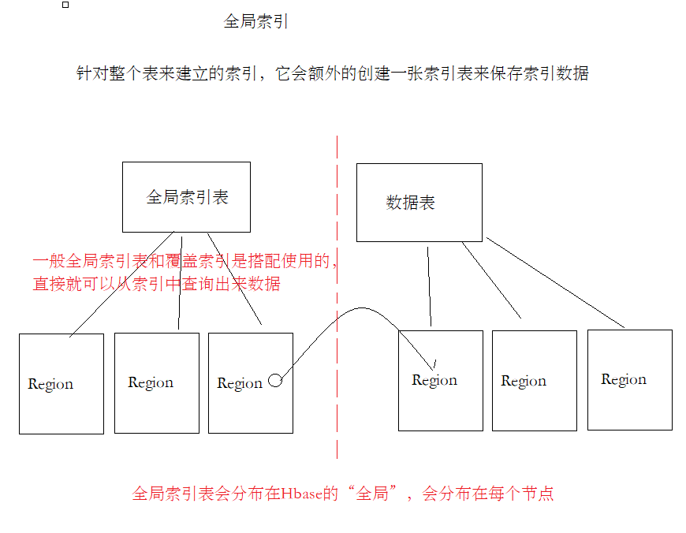

# HBase第二天课堂笔记

## 名称空间

* namespace：名称空间
* 默认hbase有两个名称空间，default、hbase
* default名称空间是默认创建表的位置，hbase是专门存放系统表的名称空间（namespace、meta）
* 管理命名空间指令
	* create_namespace 命名空间名称
	* drop_namespace 删除
	* list_namespace
	* describe_namespace
* 在命名空间中创建表
	* create "命名空间:表名"

## 表的设计

* 列蔟：推荐1-2个，能使用**1个**就不是使用2个
* 版本的设计：如果我们的项目不需要保存历史的版本，直接按照默认配置VERSIONS=1就OK。如果项目中需要保存历史的变更信息，就可以将VERSIONS设置为>1。但是设置为大于1也就意味着要占用更多的空间
* 数据的压缩：在创建表的时候，可以针对列蔟指定数据压缩方式（GZ、SNAPPY、LZO）。GZ方式是压缩比最高的，13%左右的空间，但是它的压缩和解压缩速度慢一些


## 避免热点的关键操作

1. 预分区

	* 在创建表的时候，配置一些策略，让一个table有多个region，分布在不同的HRegionServer中
	* HBase会自动进行split，如果一个region过大，HBase会自动split成两个，就是根据rowkey来横向切分

2. rowkey设计

	* 反转：举例：手机号码、时间戳，可以将手机号码反转
	* 加盐：在rowkey前面加随机数，加了随机数之后，就会导致数据查询不出来，因为HBase默认是没有二级索引的
	* hash：根据rowkey中的某个部分取hash，因为hash每次计算都一样的值。所以，我们可以用hash操作获取数据

	* 这几种策略，因为要将数据均匀分布在集群中的每个RegionServer，所以其核心就是把rowkey打散后放入到集群节点中，所以数据不再是有序的存储，会导致scan的效率下降

## 预分区

* 预分区有两种策略

	* startKey、endKey来预分区 [10, 40, 50]

		

	* 直接指定数量，startKey、endKey由hbase自动生成，还需要指定key的算法

* HBase的数据都是存放在HDFS中

	* /hbase/data/命名空间/表/列蔟/StoreFiles


## 陌陌消息项目开发

### 项目初始化

IDEA如果依赖报错，

* 选择源码文件，执行idea中的rebuild
* 执行maven的compile
* 关掉idea，再打开一次

### 随机生成一条消息

1. 通过ExcelReader工具类从Excel文件中读取数据，放入到一个Map结构中
	* key：字段名
	* value：List，字段对应的数据列表
2. 创建getOneMessage方法，这个方法专门用来根据Excel读取到的数据，随机生成一个Msg实体对象
	* 调用ExcelReader.randomColumn方法来随机获取一个列的数据
3. 注意：消息使用的是系统当前时间，时间的格式是：年-月-日 小时:分钟:秒

```java
public class MoMoMsgGen {
    public static void main(String[] args) {
        // 读取Excel文件中的数据
        Map<String, List<String>> resultMap =
                ExcelReader.readXlsx("D:\\课程研发\\51.V8.0_NoSQL_MQ\\2.HBase\\3.代码\\momo_chat_app\\data\\测试数据集.xlsx", "陌陌数据");

        System.out.println(getOneMessage(resultMap));
    }

    /**
     * 基于从Excel表格中读取的数据随机生成一个Msg对象
     * @param resultMap Excel读取的数据（Map结构）
     * @return 一个Msg对象
     */
    public static Msg getOneMessage(Map<String, List<String>> resultMap) {
        // 1.	构建Msg实体类对象
        Msg msg = new Msg();

        // 将当前系统的时间设置为消息的时间，以年月日 时分秒的形式存储
        SimpleDateFormat simpleDateFormat = new SimpleDateFormat("yyyy-MM-dd HH:mm:ss");
        // 获取系统时间
        Date now = new Date();
        msg.setMsg_time(simpleDateFormat.format(now));

        // 2.	调用ExcelReader中的randomColumn随机生成一个列的数据
        // 初始化sender_nickyname字段，调用randomColumn随机取nick_name设置数据
        msg.setSender_nickyname(ExcelReader.randomColumn(resultMap, "sender_nickyname"));
        msg.setSender_account(ExcelReader.randomColumn(resultMap, "sender_account"));
        msg.setSender_sex(ExcelReader.randomColumn(resultMap, "sender_sex"));
        msg.setSender_ip(ExcelReader.randomColumn(resultMap, "sender_ip"));
        msg.setSender_os(ExcelReader.randomColumn(resultMap, "sender_os"));
        msg.setSender_phone_type(ExcelReader.randomColumn(resultMap, "sender_phone_type"));
        msg.setSender_network(ExcelReader.randomColumn(resultMap, "sender_network"));
        msg.setSender_gps(ExcelReader.randomColumn(resultMap, "sender_gps"));
        msg.setReceiver_nickyname(ExcelReader.randomColumn(resultMap, "receiver_nickyname"));
        msg.setReceiver_ip(ExcelReader.randomColumn(resultMap, "receiver_ip"));
        msg.setReceiver_account(ExcelReader.randomColumn(resultMap, "receiver_account"));
        msg.setReceiver_os(ExcelReader.randomColumn(resultMap, "receiver_os"));
        msg.setReceiver_phone_type(ExcelReader.randomColumn(resultMap, "receiver_phone_type"));
        msg.setReceiver_network(ExcelReader.randomColumn(resultMap, "receiver_network"));
        msg.setReceiver_gps(ExcelReader.randomColumn(resultMap, "receiver_gps"));
        msg.setReceiver_sex(ExcelReader.randomColumn(resultMap, "receiver_sex"));
        msg.setMsg_type(ExcelReader.randomColumn(resultMap, "msg_type"));
        msg.setDistance(ExcelReader.randomColumn(resultMap, "distance"));
        msg.setMessage(ExcelReader.randomColumn(resultMap, "message"));

        // 3.	注意时间使用系统当前时间

        return msg;
    }
}
```

### 生成rowkey

1. ROWKEY = MD5Hash_发件人账号_收件人账号_消息时间戳
2. MD5Hash.getMD5AsHex生成MD5值，为了缩短rowkey，取前8位


```java
    // 根据Msg实体对象生成rowkey
    public static byte[] getRowkey(Msg msg) throws ParseException {
        //
        // ROWKEY = MD5Hash_发件人账号_收件人账号_消息时间戳
        //
        // 使用StringBuilder将发件人账号、收件人账号、消息时间戳使用下划线（_）拼接起来
        StringBuilder builder = new StringBuilder();
        builder.append(msg.getSender_account());
        builder.append("_");
        builder.append(msg.getReceiver_account());
        builder.append("_");
        // 获取消息的时间戳
        String msgDateTime = msg.getMsg_time();
        SimpleDateFormat simpleDateFormat = new SimpleDateFormat("yyyy-MM-dd HH:mm:ss");
        Date msgDate = simpleDateFormat.parse(msgDateTime);
        long timestamp = msgDate.getTime();
        builder.append(timestamp);

        // 使用Bytes.toBytes将拼接出来的字符串转换为byte[]数组
        // 使用MD5Hash.getMD5AsHex生成MD5值，并取其前8位
        String md5AsHex = MD5Hash.getMD5AsHex(builder.toString().getBytes());
        String md5Hex8bit = md5AsHex.substring(0, 8);

        // 再将MD5值和之前拼接好的发件人账号、收件人账号、消息时间戳，再使用下划线拼接，转换为Bytes数组
        String rowkeyString = md5Hex8bit + "_" + builder.toString();
        System.out.println(rowkeyString);

        return Bytes.toBytes(rowkeyString);
    }
```

### 将随机生成的数据推入到HBase

```java
    public static void main(String[] args) throws ParseException, IOException {
        // 读取Excel文件中的数据
        Map<String, List<String>> resultMap =
                ExcelReader.readXlsx("D:\\课程研发\\51.V8.0_NoSQL_MQ\\2.HBase\\3.代码\\momo_chat_app\\data\\测试数据集.xlsx", "陌陌数据");


        // 生成数据到HBase中
        // 1. 获取Hbase连接
        Configuration config = HBaseConfiguration.create();
        Connection connection = ConnectionFactory.createConnection(config);

        // 2. 获取HBase表MOMO_CHAT:MSG
        Table table = connection.getTable(TableName.valueOf("MOMO_CHAT:MSG"));

        int i = 0;
        int MAX = 100000;

        while (i < MAX) {
            Msg msg = getOneMessage(resultMap);
            // 3. 初始化操作Hbase所需的变量（列蔟、列名）
            byte[] rowkey = getRowkey(msg);
            String cf = "C1";
            String colMsg_time = "msg_time";
            String colSender_nickyname = "sender_nickyname";
            String colSender_account = "sender_account";
            String colSender_sex = "sender_sex";
            String colSender_ip = "sender_ip";
            String colSender_os = "sender_os";
            String colSender_phone_type = "sender_phone_type";
            String colSender_network = "sender_network";
            String colSender_gps = "sender_gps";
            String colReceiver_nickyname = "receiver_nickyname";
            String colReceiver_ip = "receiver_ip";
            String colReceiver_account = "receiver_account";
            String colReceiver_os = "receiver_os";
            String colReceiver_phone_type = "receiver_phone_type";
            String colReceiver_network = "receiver_network";
            String colReceiver_gps = "receiver_gps";
            String colReceiver_sex = "receiver_sex";
            String colMsg_type = "msg_type";
            String colDistance = "distance";
            String colMessage = "message";

            // 4. 构建put请求
            Put put = new Put(rowkey);

            // 5. 挨个添加陌陌消息的所有列
            put.addColumn(Bytes.toBytes(cf), Bytes.toBytes(colMsg_time), Bytes.toBytes(msg.getMsg_time()));
            put.addColumn(Bytes.toBytes(cf), Bytes.toBytes(colSender_nickyname), Bytes.toBytes(msg.getSender_nickyname()));
            put.addColumn(Bytes.toBytes(cf), Bytes.toBytes(colSender_account), Bytes.toBytes(msg.getSender_account()));
            put.addColumn(Bytes.toBytes(cf), Bytes.toBytes(colSender_sex), Bytes.toBytes(msg.getSender_sex()));
            put.addColumn(Bytes.toBytes(cf), Bytes.toBytes(colSender_ip), Bytes.toBytes(msg.getSender_ip()));
            put.addColumn(Bytes.toBytes(cf), Bytes.toBytes(colSender_os), Bytes.toBytes(msg.getSender_os()));
            put.addColumn(Bytes.toBytes(cf), Bytes.toBytes(colSender_phone_type), Bytes.toBytes(msg.getSender_phone_type()));
            put.addColumn(Bytes.toBytes(cf), Bytes.toBytes(colSender_network), Bytes.toBytes(msg.getSender_network()));
            put.addColumn(Bytes.toBytes(cf), Bytes.toBytes(colSender_gps), Bytes.toBytes(msg.getSender_gps()));
            put.addColumn(Bytes.toBytes(cf), Bytes.toBytes(colReceiver_nickyname), Bytes.toBytes(msg.getReceiver_nickyname()));
            put.addColumn(Bytes.toBytes(cf), Bytes.toBytes(colReceiver_ip), Bytes.toBytes(msg.getReceiver_ip()));
            put.addColumn(Bytes.toBytes(cf), Bytes.toBytes(colReceiver_account), Bytes.toBytes(msg.getReceiver_account()));
            put.addColumn(Bytes.toBytes(cf), Bytes.toBytes(colReceiver_os), Bytes.toBytes(msg.getReceiver_os()));
            put.addColumn(Bytes.toBytes(cf), Bytes.toBytes(colReceiver_phone_type), Bytes.toBytes(msg.getReceiver_phone_type()));
            put.addColumn(Bytes.toBytes(cf), Bytes.toBytes(colReceiver_network), Bytes.toBytes(msg.getReceiver_network()));
            put.addColumn(Bytes.toBytes(cf), Bytes.toBytes(colReceiver_gps), Bytes.toBytes(msg.getReceiver_gps()));
            put.addColumn(Bytes.toBytes(cf), Bytes.toBytes(colReceiver_sex), Bytes.toBytes(msg.getReceiver_sex()));
            put.addColumn(Bytes.toBytes(cf), Bytes.toBytes(colMsg_type), Bytes.toBytes(msg.getMsg_type()));
            put.addColumn(Bytes.toBytes(cf), Bytes.toBytes(colDistance), Bytes.toBytes(msg.getDistance()));
            put.addColumn(Bytes.toBytes(cf), Bytes.toBytes(colMessage), Bytes.toBytes(msg.getMessage()));

            // 6. 发起put请求
            table.put(put);

            // 显示进度
            ++i;
            System.out.println(i + " / " + MAX);
        }
        table.close();
        connection.close();
    }
```

### 实现getMessage数据服务接口

使用scan + filter实现的

1. 构建scan对象
2. 构建4个filter（开始日期查询、结束日期查询、发件人、收件人）
3. 构建一个Msg对象列表

```java
    /**
     *
     * @param date 日期 2020-09-10
     * @param sender 发件人
     * @param receiver 收件人
     * @return
     * @throws Exception
     */
    @Override
    public List<Msg> getMessage(String date, String sender, String receiver) throws Exception {
        // 1.	构建scan对象
        Scan scan = new Scan();

        // 构建两个带时分秒的日期字符串
        String startDateStr = date + " 00:00:00";
        String endDateStr = date + " 23:59:59";

        // 2.	构建用于查询时间的范围，例如：2020-10-05 00:00:00 – 2020-10-05 23:59:59
        // 3.	构建查询日期的两个Filter，大于等于、小于等于，此处过滤单个列使用SingleColumnValueFilter即可。
        SingleColumnValueFilter startDateFilter = new SingleColumnValueFilter(Bytes.toBytes("C1")
                , Bytes.toBytes("msg_time")
                , CompareOperator.GREATER_OR_EQUAL
                , new BinaryComparator(Bytes.toBytes(startDateStr)));

        SingleColumnValueFilter endDateFilter = new SingleColumnValueFilter(Bytes.toBytes("C1")
                , Bytes.toBytes("msg_time")
                , CompareOperator.LESS_OR_EQUAL
                , new BinaryComparator(Bytes.toBytes(endDateStr)));

        // 4.	构建发件人Filter
        SingleColumnValueFilter senderFilter = new SingleColumnValueFilter(Bytes.toBytes("C1")
                , Bytes.toBytes("sender_account")
                , CompareOperator.EQUAL
                , new BinaryComparator(Bytes.toBytes(sender)));

        // 5.	构建收件人Filter
        SingleColumnValueFilter receiverFilter = new SingleColumnValueFilter(Bytes.toBytes("C1")
                , Bytes.toBytes("receiver_account")
                , CompareOperator.EQUAL
                , new BinaryComparator(Bytes.toBytes(receiver)));

        // 6.	使用FilterList组合所有Filter
        FilterList filterList = new FilterList(FilterList.Operator.MUST_PASS_ALL
                , startDateFilter
                , endDateFilter
                , senderFilter
                , receiverFilter);

        // 7.	设置scan对象filter
        scan.setFilter(filterList);

        // 8.	获取HTable对象，并调用getScanner执行
        Table table = connection.getTable(TableName.valueOf("MOMO_CHAT:MSG"));
        ResultScanner resultScanner = table.getScanner(scan);

        // 9.	获取迭代器，迭代每一行，同时迭代每一个单元格
        Iterator<Result> iterator = resultScanner.iterator();

        // 创建一个列表，用于保存查询出来的消息
        ArrayList<Msg> msgList = new ArrayList<>();

        while(iterator.hasNext()) {
            // 每一行查询出来的数据都是一个Msg对象
            Result result = iterator.next();
            Msg msg = new Msg();
            // 获取rowkey
            String rowkey = Bytes.toString(result.getRow());
            // 单元格列表
            List<Cell> cellList = result.listCells();

            for (Cell cell : cellList) {
                // 根据当前的cell单元格的列名来判断，设置对应的字段
                String columnName = Bytes.toString(cell.getQualifierArray(), cell.getQualifierOffset(), cell.getQualifierLength());
                if(columnName.equals("msg_time")) {
                    msg.setMsg_time(Bytes.toString(cell.getValueArray(), cell.getValueOffset(), cell.getValueLength()));
                }
                if(columnName.equals("sender_nickyname")){
                    msg.setSender_nickyname(Bytes.toString(cell.getValueArray(), cell.getValueOffset(), cell.getValueLength()));
                }
                if(columnName.equals("sender_account")){
                    msg.setSender_account(Bytes.toString(cell.getValueArray(), cell.getValueOffset(), cell.getValueLength()));
                }
                if(columnName.equals("sender_sex")){
                    msg.setSender_sex(Bytes.toString(cell.getValueArray(), cell.getValueOffset(), cell.getValueLength()));
                }
                if(columnName.equals("sender_ip")){
                    msg.setSender_ip(Bytes.toString(cell.getValueArray(), cell.getValueOffset(), cell.getValueLength()));
                }
                if(columnName.equals("sender_os")){
                    msg.setSender_os(Bytes.toString(cell.getValueArray(), cell.getValueOffset(), cell.getValueLength()));
                }
                if(columnName.equals("sender_phone_type")){
                    msg.setSender_phone_type(Bytes.toString(cell.getValueArray(), cell.getValueOffset(), cell.getValueLength()));
                }
                if(columnName.equals("sender_network")){
                    msg.setSender_network(Bytes.toString(cell.getValueArray(), cell.getValueOffset(), cell.getValueLength()));
                }
                if(columnName.equals("sender_gps")){
                    msg.setSender_gps(Bytes.toString(cell.getValueArray(), cell.getValueOffset(), cell.getValueLength()));
                }
                if(columnName.equals("receiver_nickyname")){
                    msg.setReceiver_nickyname(Bytes.toString(cell.getValueArray(), cell.getValueOffset(), cell.getValueLength()));
                }
                if(columnName.equals("receiver_ip")){
                    msg.setReceiver_ip(Bytes.toString(cell.getValueArray(), cell.getValueOffset(), cell.getValueLength()));
                }
                if(columnName.equals("receiver_account")){
                    msg.setReceiver_account(Bytes.toString(cell.getValueArray(), cell.getValueOffset(), cell.getValueLength()));
                }
                if(columnName.equals("receiver_os")){
                    msg.setReceiver_os(Bytes.toString(cell.getValueArray(), cell.getValueOffset(), cell.getValueLength()));
                }
                if(columnName.equals("receiver_phone_type")){
                    msg.setReceiver_phone_type(Bytes.toString(cell.getValueArray(), cell.getValueOffset(), cell.getValueLength()));
                }
                if(columnName.equals("receiver_network")){
                    msg.setReceiver_network(Bytes.toString(cell.getValueArray(), cell.getValueOffset(), cell.getValueLength()));
                }
                if(columnName.equals("receiver_gps")){
                    msg.setReceiver_gps(Bytes.toString(cell.getValueArray(), cell.getValueOffset(), cell.getValueLength()));
                }
                if(columnName.equals("receiver_sex")){
                    msg.setReceiver_sex(Bytes.toString(cell.getValueArray(), cell.getValueOffset(), cell.getValueLength()));
                }
                if(columnName.equals("msg_type")){
                    msg.setMsg_type(Bytes.toString(cell.getValueArray(), cell.getValueOffset(), cell.getValueLength()));
                }
                if(columnName.equals("distance")){
                    msg.setDistance(Bytes.toString(cell.getValueArray(), cell.getValueOffset(), cell.getValueLength()));
                }
                if(columnName.equals("message")){
                    msg.setMessage(Bytes.toString(cell.getValueArray(), cell.getValueOffset(), cell.getValueLength()));
                }
            }

            msgList.add(msg);
        }

        // 关闭资源
        resultScanner.close();
        table.close();

        return msgList;
    }
```

## Apache Phoenix

### 简介

* Apache Phoenix基于HBase的一个SQL引擎，我们可以使用Phoenix在HBase之上提供SQL语言的支持。
* Phoenix是可以支持二级索引的，而且Phoenix它自动帮助我们管理二级索引，底层是通过HBase的协处理器来实现的，通过配合二级索引和HBase rowkey，可以提升hbase的查询效率
* Phoenix底层还是将SQL语言解析为HBase的原生查询（put/get/scan），所以它的定位还是在随机实时查询——OLTP领域
* Apache Phoenix不是独立运行的，而是提供一些JAR包，扩展了HBase的功能

### Phoenix安装

* Phoenix是基于HBase进行扩展的，核心就是一些phoenix开头的jar包，这些jar包实现了很多的协处理器（当执行put/delete/get这些操作的时候，可以执行一段特殊的代码）
* 安装的时候注意：

> * 将phoenix开头的jar包复制到每一个hbase的节点
> * hbase-site.xml需要复制到每一个节点

### Phoenix的建表语法

在Phoenix中，要执行SQL，必须要建立表的结构，然后才能查询。默认Phoenix不会之前在Hbase使用create创建的表加载进来。

```sql
create table if not exists ORDER_DTL(
    "id" varchar primary key,
    "C1"."status" varchar,
    "C1"."money" double,
    "C1"."pay_way" integer,
    "C1"."user_id" varchar,
    "C1"."operation_time" varchar,
    "C1"."category" varchar
);
```

> 注意事项：
>
> * 每个表必须要有rowkey，通过指定某一个列后面的primary key，就表示该列就是rowkey
> * 每个除了rowkey的列必须要带列蔟名，Phoenix会自动帮助我们创建列蔟
> * 大小写的问题，在Phoenix如果要使用小写，必须得带双引号。否则会自动转换为大小，如果使用小写将来编写的任何SQL语句都得带双引号

### Phoenix数据操作

* 插入/更新都是使用upsert

	```sql
	upsert 表名(列蔟.列1, 列蔟.列2,...) values(...)
	```

* 删除

	```sql
	delete from 表名 where ...
	```

* 查询

	```sql
	select *或列名 from 表名 where
	```

	

> 注意大小写问题，如果列名是小写，必须要加上双引号

### Phoenix预分区

* 在将来使用Phoenix创建表的时候，也可以指定预分区
	* 基于rowkey来进行分区
	* 指定分区的数量

```sql
-- 1. 使用指定rowkey来进行预分区
drop table if exists ORDER_DTL;
create table if not exists ORDER_DTL(
    "id" varchar primary key,
    C1."status" varchar,
    C1."money" float,
    C1."pay_way" integer,
    C1."user_id" varchar,
    C1."operation_time" varchar,
    C1."category" varchar
) 
CONPRESSION='GZ'
SPLIT ON ('3','5','7');

-- 2. 直接指定Region的数量来进行预分区
drop table if exists ORDER_DTL;
create table if not exists ORDER_DTL(
    "id" varchar primary key,
    C1."status" varchar,
    C1."money" float,
    C1."pay_way" integer,
    C1."user_id" varchar,
    C1."operation_time" varchar,
    C1."category" varchar
) 
CONPRESSION='GZ', SALT_BUCKETS=10;

```

### Phoenix创建视图

* 将HBase已经存在的表进行映射

* 名称空间和表名一模一样
* 列蔟名和列名也必须要一一对应

```sql
create view "名称空间"."表名"(
   rowkey对应列名 varchar primary key,
   "列蔟名"."列名" varchar,
);
```

### Phoenix JDBC开发

驱动：PhoenixDriver.class.getName()

JDBC连接URL：jdbc:phoenix:node1.itcast.cn:2181


1. 加载JDBC驱动
2. 使用DriverManager获取连接
3. 准备一个SQL语句
4. 准备PrepareStatement
5. 设置参数
6. 执行语句
7. 遍历结果
8. 关闭资源

## Phoneix索引的分类

1. 全局索引
	* 针对整个表，在整个HBase集群中，都是有效的，索引数据会分布在全局
2. 本地索引
	* 索引数据和表数据存储在一起，方便高效查询
3. 覆盖索引
	* 将数据直接放入在索引中，直接查询索引就可以将数据查询出来，避免再根据rowkey查询数据
4. 函数索引
	* 基于一个函数表达式来建立索引，例如： where substr(xxx, 0, 10)....，就可以基于substr(xxx, 0, 10)建立索引

### 全局索引+覆盖索引

全局索引会独立创建一张HBase的表来保存索引数据，一般经常配合覆盖索引使用。将要查询的列、以及索引列全部的数据保存在索引表中，这样，可以有效避免，查索引之后还要去查询数据表。一次查询，全部搞定。



```sql
-- 二、在phoenix中创建二级索引
-- 根据用户ID来查询订单的ID以及对应的支付金额
-- 建立一个覆盖索引，加快查询
create index IDX_USER_ID on ORDER_DTL(C1."user_id") include ("id", C1."money");

-- 删除索引
drop index IDX_USER_ID on ORDER_DTL;

-- 强制使用索引查询
explain select /*+ INDEX(ORDER_DTL IDX_USER_ID) */ * from ORDER_DTL where "user_id" = '8237476';
```

## 本地索引

* 使用 create local index 索引名称 on 表名(列1, 列2)
* 本地索引对数据是有侵入性的，就是原先的数据会被编码处理，所以只要创建了本地索引，原先的数据就会隐藏起来
* 性能提升几十倍、上百倍
* 当drop掉索引后，数据又可以恢复回来
* 这些都是由Phoenix的协处理器来实现的